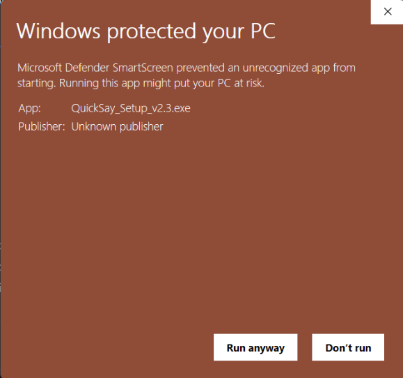

# QuickSay

**Voice-to-text dictation for Windows.** Press a hotkey, speak, and your words appear as text wherever your cursor is.

QuickSay uses Groq's Whisper API for fast, accurate speech-to-text transcription with optional AI-powered text cleanup that adds punctuation, fixes grammar, and removes filler words.

---

## Download

**[Download QuickSay Beta v1.8.0 Installer](https://github.com/lucid4life/QuickSay/releases/tag/v1.8.0)**

Click the link above, then download **QuickSay_Beta_v1.8_Setup.exe** from the Assets section.

---

## Installation

1. Download and run **QuickSay_Beta_v1.8_Setup.exe**
2. Follow the installer prompts (installs to your user folder — no admin required)
3. The onboarding wizard will launch automatically
4. Get a free API key from [Groq Console](https://console.groq.com/keys) and paste it in
5. Click **Test Key** to verify it works, then click **Continue**
6. Click **Launch QuickSay** — you're ready to go

## Windows SmartScreen Warning

When you first run the installer, Windows may show a SmartScreen warning. QuickSay is code-signed with Microsoft Azure Trusted Signing, but SmartScreen may still flag it until the app builds reputation through downloads.

**To proceed:**

1. Click **"More info"**
2. Click **"Run anyway"**

---

## Usage

1. **Hold `Ctrl + Win`** to start recording
2. **Speak naturally** — say whatever you want to type
3. **Release the keys** to stop recording
4. Your transcribed text appears at the cursor position in any application

### Settings

Right-click the **QuickSay** icon in your system tray to access Settings, where you can:

- Change the hotkey
- Select your microphone (USB, Bluetooth, headset, or built-in)
- Toggle AI text cleanup (punctuation, grammar, filler word removal)
- Switch between modes (Standard, Email, Code, Casual, or custom)
- Add custom dictionary words for domain-specific terms
- Choose a sound theme and enable/disable audio feedback
- Set QuickSay to launch at startup

## Features

- **Global hotkey** — works in any application, fully customizable
- **Fast transcription** — powered by Groq's Whisper Large V3 Turbo
- **AI text cleanup** — smart punctuation, grammar fixes, filler word removal
- **Multiple modes** — Standard, Email, Code, and Casual presets with custom mode support
- **Any microphone** — USB, Bluetooth, built-in, or headset
- **Custom dictionary** — map spoken words to specific spellings
- **Floating widget** — always-on-top recording indicator with click-to-record
- **File transcription** — transcribe existing audio files from the tray menu
- **Usage statistics** — track words dictated, time saved, and top apps
- **Sound themes** — 6 built-in audio themes for recording feedback
- **Auto-updates** — checks for new versions automatically
- **System tray** — runs quietly in the background

## Requirements

- Windows 10 or Windows 11
- A microphone
- Internet connection
- A [Groq API key](https://console.groq.com/keys) (free tier available)

## Feedback

Found a bug or have a suggestion? [Open an issue](https://github.com/lucid4life/QuickSay/issues) and let us know.

You can also visit **[quicksay.app](https://quicksay.app)** for more information.

## License

[MIT License](LICENSE)
